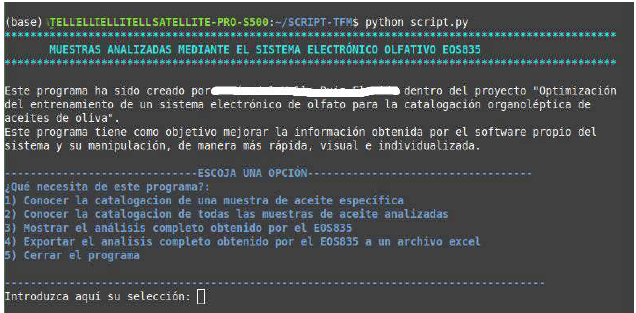
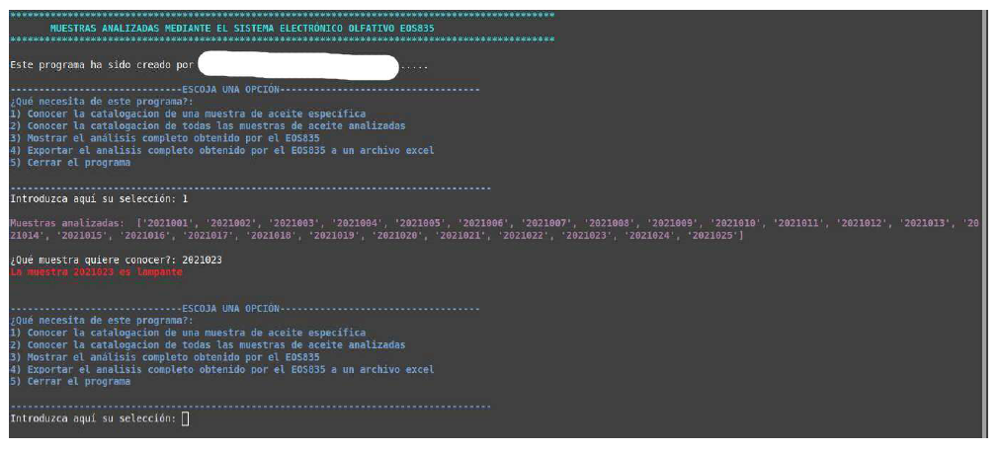
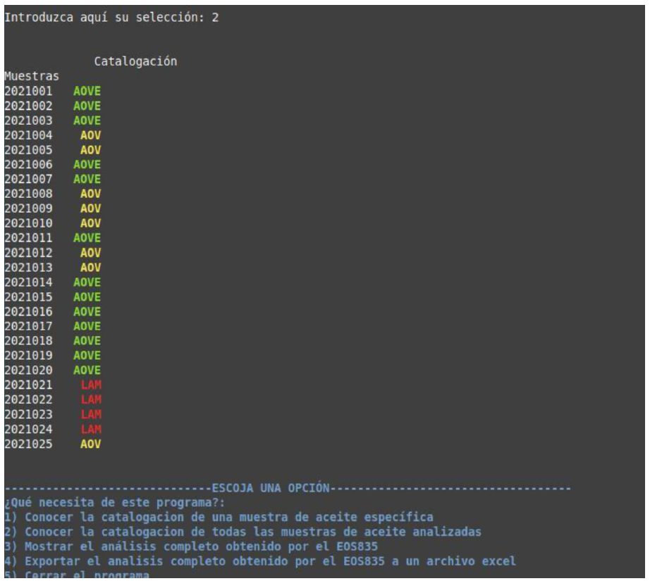
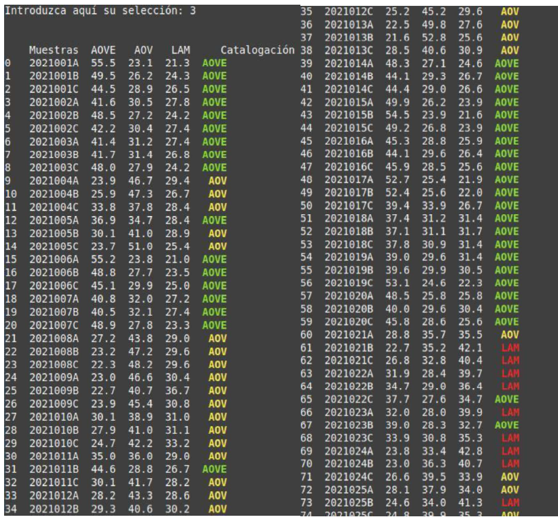
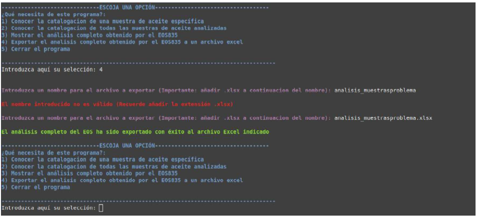
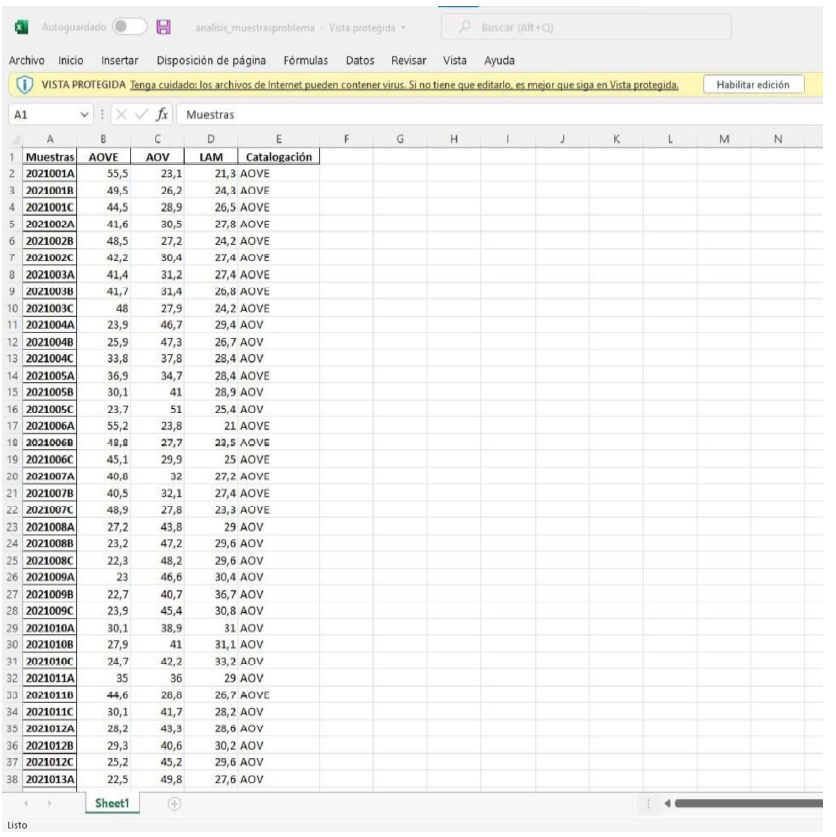
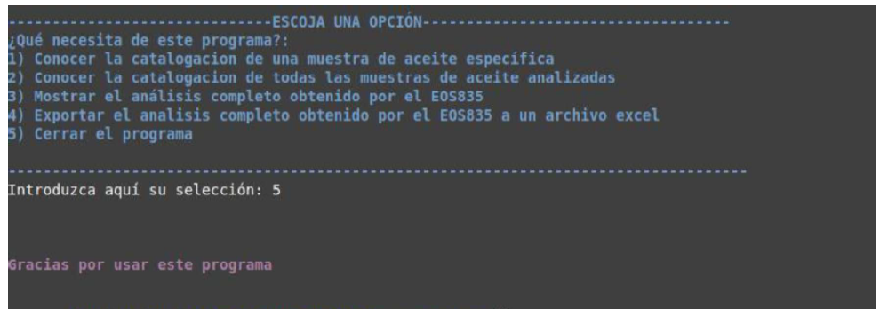

# Catalogación de aceites de oliva con un sistema electrónico de olfato

Programa en Python desarrollado como parte de mi Trabajo de Fin de Máster en
Biotecnología (2022), centrado en la optimización de un sistema electrónico de
olfato (EOS835, "nariz electrónica") para clasificar aceites de oliva vírgenes
en sus categorías comerciales (Virgen Extra, Virgen, Lampante) de forma
automatizada, como alternativa al panel de cata tradicional.

> **Nota:** este script se escribió a mano en 2022, antes de que existieran
> asistentes de IA para programar (ChatGPT, Copilot, etc.). Todo el
> parseo con expresiones regulares, la lógica de clasificación y la interfaz
> de consola se diseñaron desde cero consultando documentación de Pandas/NumPy,
> sin ayuda de IA. Lo dejo intacto tal cual se usó en el TFM, como fue escrito.

El software propio del equipo exporta los resultados de clasificación a un
archivo de texto plano. Este script los convierte en una herramienta
interactiva por consola para consultarlos, visualizarlos y exportarlos,
sin tener que abrir y manipular el archivo original a mano.

## Qué hace

- Lee el archivo de resultados exportado por el sistema (formato `.txt`).
- Extrae, mediante expresiones regulares, el porcentaje de proximidad de
  cada muestra a las tres categorías (AOVE / AOV / LAM).
- Calcula la catalogación de cada muestra según el porcentaje más alto.
- Ofrece un menú interactivo para:
  1. Consultar la catalogación de una muestra concreta.
  2. Ver la catalogación de todas las muestras analizadas.
  3. Ver el análisis completo (todas las réplicas y porcentajes).
  4. Exportar el análisis completo a un archivo Excel (`.xlsx`).

## Cómo probarlo

```bash
pip install -r requirements.txt
cp data/ejemplo_results.txt results.txt
python script.py
```

El repositorio incluye los datos reales de clasificación
(`data/results.txt`), obtenidos con el entrenamiento 2 del sistema, con un
índice de acierto del 76% frente al panel de cata.

## Cómo se ve















## Limitación conocida

La extracción por regex de la categoría `AOV` puede confundirse con la
subcadena `"AOV"` que forma parte de `"AOVE"` cuando esta última aparece
primero en la línea de resultados. Es un detalle que dejo documentado en vez
de corregir, para conservar el script tal y como se usó en el TFM.

## Tecnologías

Python 3, Pandas, NumPy.
